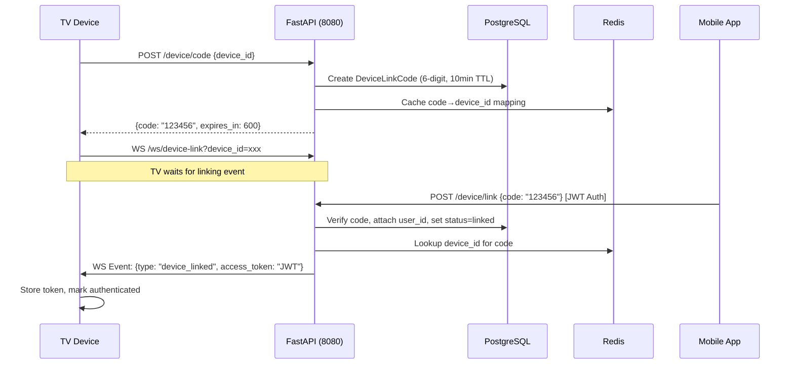

# 6-Digit Device Linking System for TV Login

Backend implementation of a Netflix/YouTube-style 6-digit code login for TV devices, replacing the current QR/room-based pairing system. New endpoints on the **FastAPI** service (port 8080), with a new Django model + migration on the **Django** service (port 8000).

---

## Phase 1 — Repository Analysis (Technical Report)

### Project Architecture
- **Split-backend**: Django 5.1 (`/common`, port 8000) + FastAPI (`/api`, port 8080), orchestrated via `docker-compose.yml`
- **Django**: CRUD, auth, ORM (PostgreSQL), Celery, DRF, admin
- **FastAPI**: Real-time WebSockets, QR pairing, async endpoints, uses SQLAlchemy for DB access and Redis for state

### Authentication Flow
- Django uses **SimpleJWT** (`rest_framework_simplejwt`) — `TokenObtainPairView` + `TokenRefreshView`
- FastAPI uses **python-jose** (`jwt.encode`/`jwt.decode`) with shared `SECRET_KEY` + `JWT_HASH_ALGORITHM` from `.env`
- `get_current_user()` in `api/utils/token.py` decodes JWT tokens for FastAPI endpoints
- Google OAuth2 via `social-auth-app-django`

### WebSocket Architecture
- `ConnectionManager` singleton in [websocket_manager.py](file:///c:/Users/Utkar/python_deckoviz01/api/utils/websocket_manager.py) — room-based `Dict[str, Set[WebSocket]]`
- Methods: `connect()`, `disconnect()`, `broadcast()`, `send_to_client()`
- Used by [qr_code_redis.py](file:///c:/Users/Utkar/python_deckoviz01/api/routers/qr_code_redis.py) for `/ws/tv` and `/ws/mobile` endpoints
- `QRRedisManager` stores device/room metadata in Redis with TTL-based expiration

### Database Structure
- PostgreSQL with Django ORM. Base model pattern: `BaseModel(TimeStampedModel)` → UUID PK, `created_at`, `updated_at`
- User model: `User(AbstractUser, BaseModel)` with `room` UUID field, stored in `users` table
- Migrations in `common/apps/authentication/migrations/`

### Existing Device Pairing Logic
- **QR-based**: TV calls `POST /qr/generate-qr` → gets QR image + `device_id` → polls `GET /qr/device/{device_id}/room`
- Mobile scans QR, calls `POST /qr/pair` (authenticated) → stores room_id + user_id in Redis
- TV detects pairing via polling, receives `room_id` + JWT `access_token`
- TV connects to `/ws/tv?room={room_id}`, mobile connects to `/ws/mobile?room={room_id}&token={token}`
- **All state is Redis-only** (no database table for device pairing)

---

## Phase 2 — System Design

### Architecture Overview



### Database Schema

```sql
-- Table: device_link_codes
CREATE TABLE device_link_codes (
    id            UUID PRIMARY KEY DEFAULT gen_random_uuid(),
    code          VARCHAR(6) NOT NULL,
    device_id     VARCHAR(255) NOT NULL,
    user_id       UUID NULL REFERENCES users(id),
    status        VARCHAR(10) NOT NULL DEFAULT 'pending',  -- pending | linked | expired
    expires_at    TIMESTAMP WITH TIME ZONE NOT NULL,
    created_at    TIMESTAMP WITH TIME ZONE DEFAULT NOW()
);

CREATE INDEX idx_device_link_codes_code ON device_link_codes(code);
CREATE INDEX idx_device_link_codes_device_id ON device_link_codes(device_id);
CREATE INDEX idx_device_link_codes_status ON device_link_codes(status);
```

### API Endpoints

| Method | Path | Auth | Description |
|--------|------|------|-------------|
| POST | `/device/code` | None | TV generates 6-digit code |
| POST | `/device/link` | JWT Required | Mobile links code to user |
| GET | `/device/status/{device_id}` | None | TV polls status (fallback) |
| WS | `/ws/device-link` | None | TV receives real-time link event |

### WebSocket Event Structure

```json
// TV receives on successful link:
{
  "type": "device_linked",
  "user_id": "uuid-string",
  "access_token": "eyJhbGc...",
  "message": "Device linked successfully"
}

// TV receives on code expiration:
{
  "type": "code_expired",
  "message": "Device link code has expired"
}
```

### Security Considerations
- **Code collision avoidance**: Check uniqueness of active (pending) codes before storing
- **Code expiration**: 10-minute TTL, expired codes rejected on link attempt
- **Rate limiting**: Max 5 code generation requests per device per hour (via Redis counter)
- **Brute force protection**: Max 5 failed link attempts per IP per 10 minutes
- **One-time use**: Code invalidated immediately after successful link
- **Automatic cleanup**: Expired codes marked via DB query before linking

---

## Proposed Changes

### FastAPI Service (`/api`)

---

#### [NEW] [device_link.py](file:///c:/Users/Utkar/python_deckoviz01/api/schemas/device_link.py)
Pydantic request/response schemas: `DeviceCodeRequest`, `DeviceCodeResponse`, `DeviceLinkRequest`, `DeviceLinkResponse`.

#### [NEW] [device_link.py](file:///c:/Users/Utkar/python_deckoviz01/api/routers/device_link.py)
FastAPI router with:
- `POST /device/code` — generates 6-digit code, stores in PostgreSQL + Redis cache
- `POST /device/link` — verifies code, attaches user, triggers WebSocket event
- `GET /device/status/{device_id}` — polling fallback for TV
- `WS /ws/device-link` — WebSocket endpoint for TV to receive link events

#### [NEW] [device_link_manager.py](file:///c:/Users/Utkar/python_deckoviz01/api/utils/device_link_manager.py)
Redis utility class (`DeviceLinkRedisManager`) for:
- Caching code→device_id mappings
- Tracking active WebSocket connections by device_id
- Rate limiting code generation

#### [NEW] [device_link_model.py](file:///c:/Users/Utkar/python_deckoviz01/api/models/device_link_model.py)
SQLAlchemy model `DeviceLinkCode` mirroring the Django model for FastAPI DB access.

#### [MODIFY] [main.py](file:///c:/Users/Utkar/python_deckoviz01/api/main.py)
Import and register the new `device_link` router.

---

### Django Service (`/common`)

---

#### [NEW] [0005_devicelinkcode.py](file:///c:/Users/Utkar/python_deckoviz01/common/apps/authentication/migrations/0005_devicelinkcode.py)
Django migration creating the `device_link_codes` table with:
- UUID PK, `code` (indexed), `device_id` (indexed), nullable `user_id` FK, `status`, `expires_at`, `created_at`

#### [MODIFY] [models.py](file:///c:/Users/Utkar/python_deckoviz01/common/apps/authentication/models.py)
Add `DeviceLinkCode` Django model to the authentication app.

---

### Testing

---

#### [NEW] [test_device_link.py](file:///c:/Users/Utkar/python_deckoviz01/api/tests/test_device_link.py)
End-to-end test script simulating the full TV login flow:
1. TV generates device code
2. Mobile links the code (with mock JWT)
3. WebSocket event received by TV
4. Includes dummy test data

---

## Verification Plan

### Automated Tests
1. **Run the test script** (requires running FastAPI + PostgreSQL + Redis):
   ```bash
   cd c:\Users\Utkar\python_deckoviz01\api
   python -m pytest tests/test_device_link.py -v
   ```
   This covers: code generation, code linking, expiration, invalid codes, WebSocket events.

2. **Django migration check** (no actual DB needed):
   ```bash
   cd c:\Users\Utkar\python_deckoviz01\common
   python manage.py showmigrations authentication
   ```

### Manual Verification
Since this project runs via Docker, full integration testing requires:
1. `docker-compose up --build`
2. Use **curl/Postman** to test:
   - `POST http://localhost:8080/device/code` with `{"device_id": "test-device-1"}`
   - `POST http://localhost:8080/device/link` with `{"code": "123456"}` + JWT Bearer token
3. Use a **WebSocket client** (e.g. `wscat`) to connect to `ws://localhost:8080/ws/device-link?device_id=test-device-1` and observe the `device_linked` event

> [!IMPORTANT]
> The test script is standalone and can simulate the flow without Docker by mocking DB calls. Full integration requires the Docker environment.
